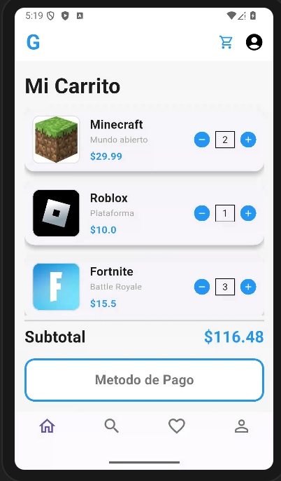

# myapp

# mi propt a la AI

En lenguaje Dart con Flutter, crear una interfaz de Carrito de Compras interactiva. La pantalla debe mostrar una G azul estilizada en el AppBar y una lista de videojuegos organizada en tarjetas (Cards) con sombreado y bordes redondeados.

Cada tarjeta debe incluir: a la izquierda, una imagen de red con bordes curvos; en el centro, una columna con título, subtítulo y precio en color azul; a la derecha, un selector de cantidad funcional con botones circulares azules (signos + y -) y un contador central enmarcado.

El diseño debe incluir un cálculo dinámico del Subtotal en color azul que se actualice al modificar las cantidades. Al final, agregar un botón de 'Método de Pago' con borde azul grueso y una barra de navegación con 4 iconos. Usar una clase Producto y un StatefulWidget para manejar el estado de la aplicación.

# mi diseño

